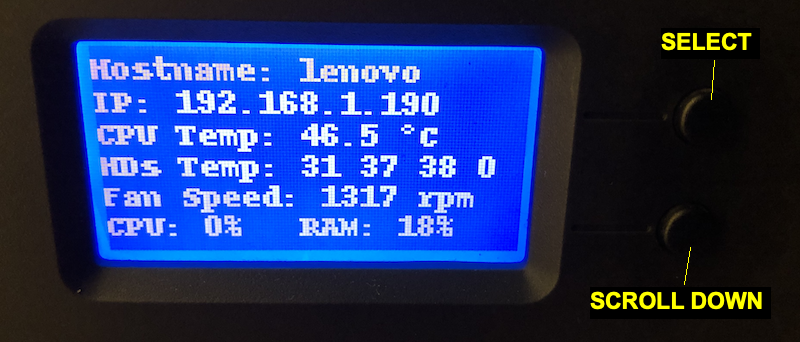
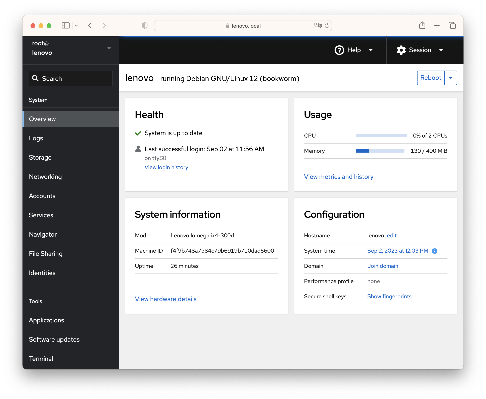
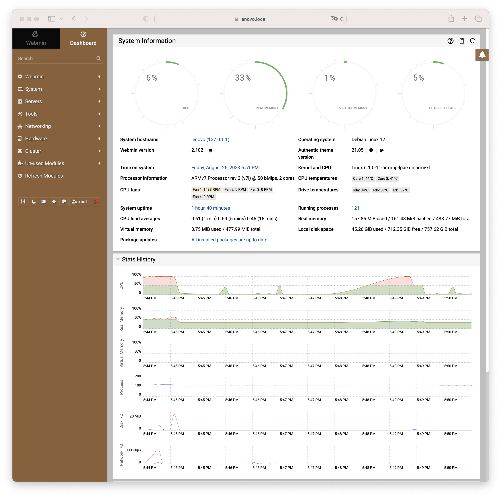

# Installing Debian 12 on Lenovo Iomega ix4-300d

The scope of this tutorial is to revamp a Lenovo Iomega ix4-300d NAS installing the last version of Debian and potentially any recent software.

Lenovo Iomega ix4-300d is a NAS released in late 2012 equipped with:
- Marvell Armada XP 1.3GHz Dual Core (MV78230 ARMv7 SoC)
- 512MB DDR3 Memory
- 4 x 3.5” SATA II (No Hot Swap)
- 2 x 1 GbE Ethernet ports
- 1 x USB 3.0 port
- 2 x USB 2.0 ports
- LCD display (128x64 pixels)
- 2 multipurpose buttons (Select and Scroll Down)

The latest **firmware** update Version 4.1.414.34909 can be found here:

http://download.lenovo.com/nas/lifeline/h4c-4.1.414.34909.tgz

The latest **imager** with that version can be found here:

https://download.lenovo.com/nasupdate/asgimage/h4c-4.1.414.34909.zip


The original firmware is based on Debian 7 (wheezy) and it is stored into a flash memory. NAS can boot without any disk if the flash is ok. If the flash is corrupted the above imager must be used.

Open source code components for LifeLine-based network devices running version [4.1.414](http://download.lenovo.com/nas/foss/lenovoemc-lifeline-fosskit-4.1.414.34909.tar.gz) can be downloade from

https://download.lenovo.com/lenovoemc/na/en/app/answers/detail/a_id/34437.html


```
BootROM 1.15
Booting from NAND flash
DDR3 Training Sequence - Ver 2.3.4
DDR3 Training Sequence - Ended Successfully
BootROM: Image checksum verification PASSED

 __   __                      _ _
|  \/  | __ _ _ ____   _____| | |
| |\/| |/ _` | '__\ \ / / _ \ | |
| |  | | (_| | |   \ V /  __/ | |
|_|  |_|\__,_|_|    \_/ \___|_|_|
         _   _     ____              _
        | | | |   | __ )  ___   ___ | |_
        | | | |___|  _ \ / _ \ / _ \| __|
        | |_| |___| |_) | (_) | (_) | |_
         \___/    |____/ \___/ \___/ \__|
 ** LOADER 2.3.2.6  **


U-Boot 2009.08 (Mar 04 2013 - 11:13:04) Marvell version:  2.3.2 PQ
U-Boot Addressing:
       Code:            00600000:006BFFF0
       BSS:             00708EC0
       Stack:           0x5fff70
       PageTable:       0x8e0000
       Heap address:    0x900000:0xe00000
Board: DB-78230-BP rev 2.0 Wistron
SoC:   MV78230 A0
       running 2 CPUs
       Custom configuration
CPU:   Marvell PJ4B (584) v7 (Rev 2) LE
       CPU # 0
       CPU @ 1333Mhz, L2 @ 667Mhz
       DDR @ 667Mhz, TClock @ 250Mhz
       DDR 32Bit Width, FastPath Memory Access
       DDR ECC Disabled
PEX 0.0(0): Root Complex Interface, Detected Link X4, GEN 1.1
PEX 1.0(1): Root Complex Interface, Detected Link X1, GEN 2.0
DRAM:  512 MB
       CS 0: base 0x00000000 size 512 MB
       Addresses 14M - 0M are saved for the U-Boot usage.
NAND:  1024 MiB
Bad block table found at page 524224, version 0x01
Bad block table found at page 524160, version 0x01
nand_read_bbt: Bad block at 0x000003c60000
FPU initialized to Run Fast Mode.
USB 0: Host Mode
USB 1: Host Mode
USB 2: Device Mode
Modules Detected:
MMC:   MRVL_MMC: 0
Net:   egiga0 [PRIME], egiga1
Hit any key to stop autoboot:  0

NAND read: device 0 offset 0x120000, size 0x400000
 4194304 bytes read: OK

NAND read: device 0 offset 0x520000, size 0x400000
 4194304 bytes read: OK
## Booting kernel from Legacy Image at 00040000 ...
   Image Name:   Linux-3.2.40
   Created:      2020-01-02  11:18:50 UTC
   Image Type:   ARM Linux Kernel Image (uncompressed)
   Data Size:    3656376 Bytes =  3.5 MB
   Load Address: 00008000
   Entry Point:  00008000
   Verifying Checksum ... OK
## Loading init Ramdisk from Legacy Image at 02000000 ...
   Image Name:
   Created:      2020-01-14  10:40:35 UTC
   Image Type:   ARM Linux RAMDisk Image (bzip2 compressed)
   Data Size:    3012478 Bytes =  2.9 MB
   Load Address: 00000000
   Entry Point:  00000000
   Verifying Checksum ... OK
   Loading Kernel Image ... OK
OK

Starting kernel ...

Uncompressing Linux... done, booting the kernel.


Welcome to CenterPoint.
ix4-300d login:
```
```
root@ix4-300d:/# cat /etc/debian_version
7.11
```
```
root@ix4-300d:/# cat /proc/version
Linux version 3.2.40 (soho@bsoho083.iomegacorp.com) (gcc version 4.7.2 (crosstool-NG 1.20.0) ) #1 SMP Thu Jan 2 06:18:39 EST 2020 v2.1.1.1
```
```
root@ix4-300d:/# cat /proc/mtd
dev:    size   erasesize  name
mtd0: 000e0000 00020000 "uboot"
mtd1: 00020000 00020000 "env"
mtd2: 00020000 00020000 "env2"
mtd3: 00400000 00020000 "zImage"
mtd4: 00400000 00020000 "initrd"
mtd5: 3f200000 00020000 "boot"
mtd6: 40000000 00020000 "flash"
```
```
root@ix4-300d:/# cat /proc/cpuinfo
Processor       : Marvell PJ4Bv7 Processor rev 2 (v7l)
processor       : 0
BogoMIPS        : 1332.01

processor       : 1
BogoMIPS        : 1332.01

Features        : swp half thumb fastmult vfp edsp vfpv3 tls
CPU implementer : 0x56
CPU architecture: 7
CPU variant     : 0x2
CPU part        : 0x584
CPU revision    : 2

Hardware        : Marvell Armada XP Development Board
Revision        : 0000
Serial          : 0000000000000000
```

The bootloader is Marvell U-Boot. My NAS has the following signature:

`U-Boot 2009.08 (Mar 04 2013 - 11:13:04) Marvell version:  2.3.2 PQ`.

The End Of Service Life (EOSL) was March 31, 2020.

## Index
- [Prerequisites](https://github.com/alf45tar/ix4-300d#prerequisites)
- [Preparing the files](https://github.com/alf45tar/ix4-300d#preparing-the-files)
- [Preparing the TFTP server](https://github.com/alf45tar/ix4-300d#preparing-the-tftp-server)
- [Preparing the USB stick](https://github.com/alf45tar/ix4-300d#preparing-the-usb-stick)
- [Connecting the USB-to-TTL adapter](https://github.com/alf45tar/ix4-300d#connecting-the-usb-to-ttl-adapter)
- [Boot the NAS from TFTP server](https://github.com/alf45tar/ix4-300d#boot-the-nas-from-tftp-server)
- [Boot the NAS from USB stick](https://github.com/alf45tar/ix4-300d#boot-the-nas-from-usb-stick)
- [Debian installation](https://github.com/alf45tar/ix4-300d#debian-installation)
- [Boot from internal disk](https://github.com/alf45tar/ix4-300d#boot-from-internal-disk)
- [Improve the experience](https://github.com/alf45tar/ix4-300d#improve-the-experience)
- [Connect temperature sensors and fan control](https://github.com/alf45tar/ix4-300d#connect-temperature-sensors-and-fan-control)
- [Personalize the LCD display](https://github.com/alf45tar/ix4-300d#personalize-the-lcd-display)
- [Using the buttons to trigger actions](https://github.com/alf45tar/ix4-300d#using-the-buttons-to-trigger-actions)
- [Controlling the leds](https://github.com/alf45tar/ix4-300d#controlling-the-leds)
- [Interacting with GPIOS](https://github.com/alf45tar/ix4-300d#interacting-with-gpios)
- [Fix the poweroff/reboot issue](https://github.com/alf45tar/ix4-300d#fix-the-poweroffreboot-issue)
- [Bridging network ports](https://github.com/alf45tar/ix4-300d#bridging-network-ports)
- [Bonding network ports](https://github.com/alf45tar/ix4-300d#bonding-network-ports)
- [Connecting to WiFi](https://github.com/alf45tar/ix4-300d#connecting-to-wifi)
- [Transform the NAS into a AirPlay speaker](https://github.com/alf45tar/ix4-300d#transform-the-nas-into-a-airplay-speaker)
- [Installing Cockpit](https://github.com/alf45tar/ix4-300d#installing-cockpit)
- [Installing Webmin](https://github.com/alf45tar/ix4-300d#installing-webmin)
- [Useful links](https://github.com/alf45tar/ix4-300d#useful-links)

## Prerequisites

- USB-to-TTL adapter (mandatory) to connect to the bootloader
- A TFTP server (faster) or and USB stick (slower) to download the Debian installer
- A PC with macOS or Windows. The following procedure is for macOS because we do not need any additional software to install for complete the task. The procedure for Windows is not documented here.
- A Linux box or a virtual machine with any Linux flavour (optional) to prepare the Debian booting image. I used an online Ubuntu VM on https://www.onworks.net.
- Wired connection from NAS Ethernet port 1 (the upper one) with DHCP and internet access to continue the Debian installation after boot.

## Preparing the files

On a Linux box:

1. Download `vmlinuz`, `initrd.gz` and `armada-xp-lenovo-ix4-300d.dtb` files from the Debian website:

   ```
   wget https://deb.debian.org/debian/dists/bookworm/main/installer-armhf/current/images/netboot/vmlinuz
   wget https://deb.debian.org/debian/dists/bookworm/main/installer-armhf/current/images/netboot/initrd.gz
   wget https://deb.debian.org/debian/dists/bookworm/main/installer-armhf/current/images/device-tree/armada-xp-lenovo-ix4-300d.dtb
   ```

2. Append dtb file to the kernel:
   ```
   cat vmlinuz armada-xp-lenovo-ix4-300d.dtb > vmlinuz_ix4_300d
   ```

3. Create an uImage with appended init ramdisk for TFTP boot:
   ```
   mkimage -A arm -O linux -T multi -C none -a 0x04000000 -e 0x04000000 -n "Debian armhf installer" -d vmlinuz_ix4_300d:initrd.gz uImage_di_ix4_300d_bookworm
   ```
4. Create separate uImage and uInitrd for USB boot:
   ```
   mkimage -A arm -O linux -T kernel  -C none -a 0x04000000 -e 0x04000000  -n "Debian armhf installer" -d vmlinuz_ix4_300d uImage_ix4_300d_bookworm
   mkimage -A arm -O linux -T ramdisk -C none -a 0x2000000  -e 0x2000000   -n "Debian armhf installer" -d initrd.gz        uInitrd_ix4_300d_bookworm
   ```
> [!NOTE]
> The `mkimage` command is used to create images for use with the U-Boot boot loader. Thes images can contain the linux kernel, device tree blob, root file system image, firmware images etc., either separate or combined.
>
> mkimage supports many image formats. Some of these formats may be used by embedded boot firmware to load U-Boot. Others may be used by U-Boot to load Linux (or some other kernel):
>
>The legacy image format concatenates the individual parts (for example, kernel image, device tree blob and ramdisk image) and adds a 64 byte header containing information about the target architecture, operating system, image type, compression method, entry points, time stamp, checksums, etc.

For smart people the files are available here ready to download.
TFTP boot|USB boot
---------|--------
[uImage_di_ix4_300d_bookworm](uImage_di_ix4_300d_bookworm)|[uImage_ix4_300d_bookworm](uImage_ix4_300d_bookworm)<br>[uInitrd_ix4_300d_bookwom](uInitrd_ix4_300d_bookwom)

We provide files for installing Debian 11 too. The tutorial remains valid just replacing `bookworm` with `bullseye`.
TFTP boot|USB boot
---------|--------
[uImage_di_ix4_300d_bullseye](uImage_di_ix4_300d_bullseye)|[uImage_ix4_300d_bullseye](uImage_ix4_300d_bullseye)<br>[uInitrd_ix4_300d_bullseye](uInitrd_ix4_300d_bullseye)

## Preparing the TFTP server

_Skip it if you want to proceed with an USB stick._

1. Copy the `uImage_di_ix4_300d_bookworm` file prepared above into `/private/tftpboot` folder of macOS.
> [!NOTE]
> By default the built in macOS TFTP server uses the folder `/private/tftpboot` which is hidden in Finder, but can be accessed by using “Go to Folder” or hitting Command+Shift+G and entering `/private/tftpboot`
3. Open a Terminal an execute the following commands:
   ```
   sudo launchctl load -F /System/Library/LaunchDaemons/tftp.plist
   ```
   ```
   sudo launchctl start com.apple.tftpd
   ```

## Preparing the USB stick

_Skip it if you prepared a TFTP server._

1. Create an USB stick with an ext2 partition as first partition. Marvell U-Boot can only boot from the first partition.
2. Copy `uImage_ix4_300d_bookworm` and `uinitrd_ix4_300d_bookworm` into it.
> [!NOTE]
> We do not need a bootable USB stick.


## Connecting the USB-to-TTL adapter

UART is on connector CN9 (four pins). Connection parameters are 115200/8N1.


Pin|Function|Description
---|--------|-----------
1|VCC|VCC can be controlled by the adjacent JP1: bridging 1 and 2 provides 3V3, bridging 2 and 3 provides 5V - but beware that this does NOT change the TX/RX voltage which is 3V3 max. VCC is not used here.
2|TX|Connect to the RX pin of your USB-to-TTL adapter
3|GND|Connect to GND of your USB-to-TTL adapter
4|RX|Connect to the TX pin of your USB-to-TTL adapter

1. Connect the USB-to-TTL adapter to an USB port of your PC.
2. On macOS Open a Terminal and execute

   ```
   screen /dev/cu.SLAB_USBtoUART 115200
   ```
   Your serial port can be different from `/dev/cu.SLAB_USBtoUART` because it depends by USB-to-TTL adapter used.
3. Power on the Lenovo Iomega ix4-300d
4. Press any key to stop the booting process and receive the Marvell U-Boot prompt
   ```
   BootROM 1.15
   Booting from NAND flash
   DDR3 Training Sequence - Ver 2.3.4
   DDR3 Training Sequence - Ended Successfully
   BootROM: Image checksum verification PASSED

   __   __                      _ _
   |  \/  | __ _ _ ____   _____| | |
   | |\/| |/ _` | '__\ \ / / _ \ | |
   | |  | | (_| | |   \ V /  __/ | |
   |_|  |_|\__,_|_|    \_/ \___|_|_|
            _   _     ____              _
           | | | |   | __ )  ___   ___ | |_
           | | | |___|  _ \ / _ \ / _ \| __|
           | |_| |___| |_) | (_) | (_) | |_
            \___/    |____/ \___/ \___/ \__|
    ** LOADER 2.3.2.6  **


   U-Boot 2009.08 (Mar 04 2013 - 11:13:04) Marvell version:  2.3.2 PQ
   U-Boot Addressing:
          Code:            00600000:006BFFF0
          BSS:             00708EC0
          Stack:           0x5fff70
          PageTable:       0x8e0000
          Heap address:    0x900000:0xe00000
   Board: DB-78230-BP rev 2.0 Wistron
   SoC:   MV78230 A0
       running 2 CPUs
       Custom configuration
   CPU:   Marvell PJ4B (584) v7 (Rev 2) LE
          CPU # 0
          CPU @ 1333Mhz, L2 @ 667Mhz
          DDR @ 667Mhz, TClock @ 250Mhz
          DDR 32Bit Width, FastPath Memory Access
          DDR ECC Disabled
   PEX 0.0(0): Root Complex Interface, Detected Link X4, GEN 1.1
   PEX 1.0(1): Root Complex Interface, Detected Link X1, GEN 2.0
   DRAM:  512 MB
          CS 0: base 0x00000000 size 512 MB
          Addresses 14M - 0M are saved for the U-Boot usage.
   NAND:  1024 MiB
   Bad block table found at page 524224, version 0x01
   Bad block table found at page 524160, version 0x01
   nand_read_bbt: Bad block at 0x000003c60000
   FPU initialized to Run Fast Mode.
   USB 0: Host Mode
   USB 1: Host Mode
   USB 2: Device Mode
   Modules Detected:
   MMC:   MRVL_MMC: 0
   Net:   egiga0 [PRIME], egiga1
   Hit any key to stop autoboot:  0
   Marvell>>
   ```

## Boot the NAS from TFTP server

_Skip it if you prepared the USB stick._

Connect the NAS Ethernet port 1 to your network. In the following we will assume `192.168.1.10` is the macOS IP address (TFTP server) and `192.168.1.111` ia an available IP address in your network not assigned by DHCP. If not ok for you, as should be, replace them with your values.

From `Marvell>>` prompt enter the following commands:

1. Set the IP address of the NAS:
   ```
   setenv ipaddr 192.168.1.111
   ```

2. Set the IP address of the macOS TFTP server:
   ```
   setenv serverip 192.168.1.10
   ```

3. Check if network connection works:
   ```
   ping 192.168.1.10
   ```

4. Transfer the Debian installer via TFTP into the NAS RAM:
   ```
   tftpboot uImage_di_ix4_300d_bookworm
   ```

5. Boot the Debian installer in RAM:
   ```
   bootm 0x2000000
   ```

## Boot the NAS from USB stick

_Skip it if you prepared the TFTP server._

1. Insert the USB stick into the **rear upper** USB port. Marvell U-Boot can only boot from the rear upper USB port.

2. From `Marvell>>` prompt enter the following commands
   ```
   usb start
   usb tree
   usb info
   usb part
   usb stop
   ext2load usb 0:1 0x0040000 uImage_ix4_300d_bookworm
   ext2load usb 0:1 0x2000000 uInitrd_ix4_300d_bookworm
   setenv bootargs $console $mtdparts root=/dev/sda2 rw rootdelay=10
   bootm 0x40000 0x2000000
   ```
> [!NOTE]
> `usb tree`, `usb info` and `usb part` are for information only.

The log of previous commands is available in the following
```
Marvell>> usb start
(Re)start USB...
USB:   Active port:     0
Register 10011 NbrPorts 1
USB EHCI 1.00
scanning bus for devices... 2 USB Device(s) found
Waiting for storage device(s) to settle before scanning...
       scanning bus for storage devices... 1 Storage Device(s) found
Marvell>> usb tree

Device Tree:
  1  Hub (480 Mb/s, 0mA)
  |  u-boot EHCI Host Controller
  |
  +-2  Mass Storage (480 Mb/s, 200mA)
         13111409002422

Marvell>> usb info
1: Hub,  USB Revision 2.0
 - u-boot EHCI Host Controller
 - Class: Hub
 - PacketSize: 64  Configurations: 1
 - Vendor: 0x0000  Product 0x0000 Version 1.0
   Configuration: 1
   - Interfaces: 1 Self Powered 0mA
     Interface: 0
     - Alternate Setting 0, Endpoints: 1
     - Class Hub
     - Endpoint 1 In Interrupt MaxPacket 8 Interval 255ms

2: Mass Storage,  USB Revision 2.0
 -   13111409002422
 - Class: (from Interface) Mass Storage
 - PacketSize: 64  Configurations: 1
 - Vendor: 0x0718  Product 0x07f0 Version 1.18
   Configuration: 1
   - Interfaces: 1 Bus Powered 200mA
     Interface: 0
     - Alternate Setting 0, Endpoints: 2
     - Class Mass Storage, Transp. SCSI, Bulk only
     - Endpoint 1 Out Bulk MaxPacket 512
     - Endpoint 2 In Bulk MaxPacket 512

Marvell>> usb part

Partition Map for USB device 0  --   Partition Type: DOS

Partition     Start Sector     Num Sectors     Type
    1                 2048         2097152      83

Marvell>> usb stop
stopping USB..
Marvell>> ext2load usb 0:1 0x0040000 uImage_ix4_300d_bookworm
Loading file "uImage_ix4_300d_bookworm" from usb device 0:1 (usbda1)
5351835 bytes read
Marvell>> ext2load usb 0:1 0x2000000 uInitrd_ix4_300d_bookworm
Loading file "uInitrd_ix4_300d_bookworm" from usb device 0:1 (usbda1)
26337308 bytes read
Marvell>> setenv bootargs $console $mtdparts root=/dev/sda2 rw rootdelay=10
Marvell>> bootm 0x40000 0x2000000
## Booting kernel from Legacy Image at 00040000 ...
   Image Name:   Debian armhf installer
   Created:      2023-08-24  21:17:04 UTC
   Image Type:   ARM Linux Kernel Image (uncompressed)
   Data Size:    5351771 Bytes =  5.1 MB
   Load Address: 04000000
   Entry Point:  04000000
   Verifying Checksum ... OK
## Loading init Ramdisk from Legacy Image at 02000000 ...
   Image Name:   Debian armhf installer
   Created:      2023-08-24  21:14:13 UTC
   Image Type:   ARM Linux RAMDisk Image (uncompressed)
   Data Size:    26337244 Bytes = 25.1 MB
   Load Address: 02000000
   Entry Point:  02000000
   Verifying Checksum ... OK
   Loading Kernel Image ... OK
OK

Starting kernel ...
```

## Debian installation

The Debian installer should start in the serial console window with the following screen
```
[            (1*installer)  2 shell  3 shell  4- log           ][ Aug 24 21:36 ]


  ┌───────────────────────┤ [!!] Select a language ├────────────────────────┐
  │                                                                         │
  │ Choose the language to be used for the installation process. The        │
  │ selected language will also be the default language for the installed   │
  │ system.                                                                 │
  │                                                                         │
  │ Language:                                                               │
  │                                                                         │
  │                               C                                         │
  │                               English                                   │
  │                                                                         │
  │     <Go Back>                                                           │
  │                                                                         │
  └─────────────────────────────────────────────────────────────────────────┘


<Tab> moves; <Space> selects; <Enter> activates buttons
```

Go through the process as shown on screen. You will receive an error related to `grub` installation at the end.
```
[            (1*installer)  2 shell  3 shell  4- log           ][ Sep 09 10:48 ]


    ┌────────────────┤ [!!] Install the GRUB boot loader ├────────────────┐
    │                                                                     │
    │                      GRUB installation failed                       │
    │ The 'grub-pc' package failed to install into /target/. Without the  │
    │ GRUB boot loader, the installed system will not boot.               │
    │                                                                     │
    │     <Go Back>                                        <Continue>     │
    │                                                                     │
    └─────────────────────────────────────────────────────────────────────┘


<Tab> moves; <Space> selects; <Enter> activates buttons
```

Select `Continue`

```
[            (1*installer)  2 shell  3 shell  4- log           ][ Sep 09 10:50 ]


     ┌───────────────┤ [!!] Install the GRUB boot loader ├───────────────┐
     │                                                                   │
     │                     Installation step failed                      │
     │ An installation step failed. You can try to run the failing item  │
     │ again from the menu, or skip it and choose something else. The    │
     │ failing step is: Install the GRUB boot loader                     │
     │                                                                   │
     │                            <Continue>                             │
     │                                                                   │
     └───────────────────────────────────────────────────────────────────┘


<Tab> moves; <Space> selects; <Enter> activates buttons
```

Select `Continue`

```
[            (1*installer)  2 shell  3 shell  4- log           ][ Sep 09 10:51 ]

             ┌─────────┤ [?] Debian installer main menu ├─────────┐
             │                                                    │
             │ Choose the next step in the install process:       │
             │                                                    │
             │      Set up users and passwords             -      │
             │      Configure the clock                    ▒      │
             │      Detect disks                           ▒      │
             │      Partition disks                        ▒      │
             │      Install the base system                ▒      │
             │      Configure the package manager          ▒      │
             │      Select and install software            ▒      │
             │      Install the GRUB boot loader           ▒      │
             │      Continue without boot loader           ▒      │
             │      Finish the installation                0      │
             │      Change debconf priority                ▒      │
             │      Save debug logs                        ▒      │
             │      Execute a shell                        ▒      │
             │      Abort the installation                 .      │
             │                                                    │
             └────────────────────────────────────────────────────┘

<Tab> moves; <Space> selects; <Enter> activates buttons
```

Select `Continue without boot loader`
```
[            (1*installer)  2 shell  3 shell  4- log           ][ Sep 09 10:53 ]


   ┌─────────────────┤ [!] Continue without boot loader ├──────────────────┐
   │                                                                       │
   │                       No boot loader installed                        │
   │ No boot loader has been installed, either because you chose not to or │
   │ because your specific architecture doesn't support a boot loader yet. │
   │                                                                       │
   │ You will need to boot manually with the /vmlinuz kernel on partition  │
   │ /dev/sda1 and root=/dev/sda2 passed as a kernel argument.             │
   │                                                                       │
   │                              <Continue>                               │
   │                                                                       │
   └───────────────────────────────────────────────────────────────────────┘


<Tab> moves; <Space> selects; <Enter> activates buttons
```

Select `Continue`

```
[            (1*installer)  2 shell  3 shell  4- log           ][ Sep 09 10:54 ]


   ┌───────────────────┤ [!!] Finish the installation ├────────────────────┐
   │                                                                       │
  ┌│                         Installation complete                         │
  ││ Installation is complete, so it is time to boot into your new system. │
  ││ Make sure to remove the installation media, so that you boot into the │
  ││ new system rather than restarting the installation.                   │
  ││                                                                       │
  ││ Please choose <Continue> to reboot.                                   │
  └│                                                                       │
   │     <Go Back>                                          <Continue>     │
   │                                                                       │
   └───────────────────────────────────────────────────────────────────────┘


<Tab> moves; <Space> selects; <Enter> activates buttons
```

Select `Go Back`

```
[            (1*installer)  2 shell  3 shell  4- log           ][ Sep 09 10:56 ]

             ┌─────────┤ [?] Debian installer main menu ├─────────┐
             │                                                    │
             │ Choose the next step in the install process:       │
             │                                                    │
             │      Set up users and passwords             -      │
             │      Configure the clock                    ▒      │
             │      Detect disks                           ▒      │
             │      Partition disks                        ▒      │
             │      Install the base system                ▒      │
             │      Configure the package manager          ▒      │
             │      Select and install software            ▒      │
             │      Install the GRUB boot loader           ▒      │
             │      Continue without boot loader           ▒      │
             │      Finish the installation                0      │
             │      Change debconf priority                ▒      │
             │      Save debug logs                        ▒      │
             │      Execute a shell                        ▒      │
             │      Abort the installation                 .      │
             │                                                    │
             └────────────────────────────────────────────────────┘

<Tab> moves; <Space> selects; <Enter> activates buttons
```

Select `Execute a shell`

```
[            (1*installer)  2 shell  3 shell  4- log           ][ Sep 09 10:56 ]


   ┌────────────────────────┤ [!] Execute a shell ├────────────────────────┐
   │                                                                       │
   │                           Interactive shell                           │
   │ After this message, you will be running "ash", a Bourne-shell clone.  │
   │                                                                       │
   │ The root file system is a RAM disk. The hard disk file systems are    │
   │ mounted on "/target". The editor available to you is nano. It's very  │
   │ small and easy to figure out. To get an idea of what Unix utilities   │
   │ are available to you, use the "help" command.                         │
   │                                                                       │
   │ Use the "exit" command to return to the installation menu.            │
   │                                                                       │
   │     <Go Back>                                          <Continue>     │
   │                                                                       │
   └───────────────────────────────────────────────────────────────────────┘


<Tab> moves; <Space> selects; <Enter> activates buttons
```

Select `Continue` and at the prompt run the following commands

```
mount --bind /dev /target/dev
mount -t proc none /target/proc
mount -t sysfs none /target/sys
chroot /target /bin/sh
apt-get update
apt-get install flash-kernel
```

The following errors are ok
```
BusyBox v1.35.0 (Debian 1:1.35.0-4+b3) built-in shell (ash)
Enter 'help' for a list of built-in commands.

~ # mount --bind /dev /target/dev
~ # mount -t proc none /target/proc
~ # mount -t sysfs none /target/sys
~ # chroot /target /bin/sh
# apt-get update
Hit:1 http://security.debian.org/debian-security bookworm-security InRelease
Hit:2 http://deb.debian.org/debian bookworm InRelease
Hit:3 http://deb.debian.org/debian bookworm-updates InRelease
Reading package lists... Done
# apt-get install flash-kernel
Reading package lists... Done
Building dependency tree... Done
Reading state information... Done
The following additional packages will be installed:
  device-tree-compiler devio libfdt1 libiniparser1 liblzo2-2 libubootenv-tool
  libubootenv0.1 libyaml-0-2 mtd-utils u-boot-tools
The following NEW packages will be installed:
  device-tree-compiler devio flash-kernel libfdt1 libiniparser1 liblzo2-2
  libubootenv-tool libubootenv0.1 libyaml-0-2 mtd-utils u-boot-tools
0 upgraded, 11 newly installed, 0 to remove and 0 not upgraded.
Need to get 810 kB of archives.
After this operation, 5143 kB of additional disk space will be used.
Do you want to continue? [Y/n] Y
.....
Creating config file /etc/default/flash-kernel with new version
Processing triggers for libc-bin (2.36-9+deb12u1) ...
Processing triggers for man-db (2.11.2-2) ...
Processing triggers for initramfs-tools (0.142) ...
update-initramfs: Generating /boot/initrd.img-6.1.0-12-armmp-lpae
W: Possible missing firmware /lib/firmware/imx/sdma/sdma-imx7d.bin for built-in driver imx_sdma
W: Possible missing firmware /lib/firmware/imx/sdma/sdma-imx6q.bin for built-in driver imx_sdma
Unsupported platform 'Lenovo Iomega ix4-300d'.
run-parts: /etc/initramfs/post-update.d//flash-kernel exited with return code 1
dpkg: error processing package initramfs-tools (--configure):
 installed initramfs-tools package post-installation script subprocess returned error exit status 1
Errors were encountered while processing:
 initramfs-tools
E: Sub-process /usr/bin/dpkg returned an error code (1)
```

Replace the content of the flash-kernel database file `/etc/flash-kernel/db` using `nano`
```
nano /etc/flash-kernel/db
```

with the following content
```
Machine: Lenovo Iomega ix4-300d
Kernel-Flavors: armmp armmp-lpae
DTB-Id: armada-xp-lenovo-ix4-300d.dtb
DTB-Append: yes
U-Boot-Kernel-Address: 0x00008000
U-Boot-Initrd-Address: 0x0
Boot-Kernel-Path: /boot/uImage
Boot-Initrd-Path: /boot/uInitrd
Boot-DTB-Path: /boot/dtb
Required-Packages: u-boot-tools
Bootloader-Sets-Incorrect-Root: no
```

Update initramfs and kernel:
```
update-initramfs -u
```

Now the errors are gone
```
update-initramfs: Generating /boot/initrd.img-6.1.0-12-armmp-lpae
W: Possible missing firmware /lib/firmware/imx/sdma/sdma-imx7d.bin for built-in driver imx_sdma
W: Possible missing firmware /lib/firmware/imx/sdma/sdma-imx6q.bin for built-in driver imx_sdma
Using DTB: armada-xp-lenovo-ix4-300d.dtb
Installing /usr/lib/linux-image-6.1.0-12-armmp-lpae/armada-xp-lenovo-ix4-300d.dtb into /boot/dtbs/6.1.0-12-armmp-lpae/./armada-xp-lenovo-ix4-300d.dtb
Installing new armada-xp-lenovo-ix4-300d.dtb.
Installing /usr/lib/linux-image-6.1.0-12-armmp-lpae/armada-xp-lenovo-ix4-300d.dtb into /boot/dtbs/6.1.0-12-armmp-lpae/./armada-xp-lenovo-ix4-300d.dtb
Taking backup of armada-xp-lenovo-ix4-300d.dtb.
Installing new armada-xp-lenovo-ix4-300d.dtb.
flash-kernel: installing version 6.1.0-12-armmp-lpae
flash-kernel: appending /usr/lib/linux-image-6.1.0-12-armmp-lpae/armada-xp-lenovo-ix4-300d.dtb to kernel
Generating kernel u-boot image... done.
Installing new uImage.
Generating initramfs u-boot image... done.
Installing new uInitrd.
Taking backup of dtb.
Installing new dtb.
```

Set label on the rootfs partition:
```
e2label /dev/sda2 rootfs
```

Exit chroot and reboot:
```
exit
reboot
```

Press any key to stop the booting process again.

## Boot from internal disk

Assuming the installation has been completed with the default disk partitioning (`/boot` on `/dev/sda1` and `/` on `/dev/sda2`) use the following commands
```
ide reset
ext2load ide 2:1 0x0040000 uImage
ext2load ide 2:1 0x2000000 uInitrd
setenv bootargs $console $mtdparts root=/dev/sda2 rw rootdelay=10
bootm 0x40000 0x2000000
```

Better to boot with label since there is no guarantee that the disk will always `sda`
```
ide reset
ext2load ide 2:1 0x0040000 uImage
ext2load ide 2:1 0x2000000 uInitrd
setenv bootargs $console $mtdparts root=LABEL=rootfs rw rootdelay=5
bootm 0x40000 0x2000000
```

or even better in a single command line
```
ide reset; ext2load ide 2:1 0x0040000 uImage; ext2load ide 2:1 0x2000000 uInitrd; setenv bootargs $console $mtdparts root=LABEL=rootfs rw rootdelay=5; bootm 0x40000 0x2000000
```

## Improve the experience

Once the Debian installation is completed I suggest to enable `root` login from network and install some packages to improve the user experience.

To enable `root` login from network add
```
PermitRootLogin yes
```
to file `/etc/ssh/sshd_config` and restart sshd service with
```
systemctl restart ssh.service
```

It is nice to have the `resize` command to set environment and terminal settings to current xterm window size. Use `resize` every time you resize the terminal window.

Avahi is a system which facilitates service discovery on a local network via the mDNS/DNS-SD protocol suite (a.k.a. Bonjour or Zeroconf).
```
apt install xterm
apt install avahi-daemon
apt install smartmontools
```

## Connect temperature sensors and fan control

One way to alter fan speed with temperature is with the package `fancontrol`. This package includes the bash script `fancontrol` and a configuration utility called `pwmconfig` which creates the configuration file `/etc/fancontrol` which is used by the `fancontrol` bash script when is starts running. This script runs as a service at startup, checks the temperature sensor of your choice every ten seconds and sets the fan speed accordingly.

> [!NOTE]
> The `fancontrol` package is not requested because the ADT7475 supports automatic fan control (see below). However, the `fancontrol` program can use the CPU and HDD temperature as an input whereas the ADT7475 only has access to its three temperature sensors.

Install the following packages
```
apt install lm-sensors
apt install fancontrol
```

Edit the `/etc/modules` as follow to load the correct kernel modules:
```
#
# This file contains the names of kernel modules that should be loaded
# at boot time, one per line. Lines beginning with "#" are ignored.
# Parameters can be specified after the module name.

# Adapter drivers
i2c_mv64xxx

# Chip drivers
adt7475

# Hard disk temperature
drivetemp
```

> [!NOTE]
> The order of listed modules is very important because it determines the numbering of sensors in `/sys` file system.

> [!NOTE]
> The Marvell [mv64[345]6x](https://www.kernel.org/doc/Documentation/devicetree/bindings/marvell.txt) series of system controller chips contain many of the peripherals needed to implement a complete computer system. For example the Discovery II MV64361 controller offers a 72-bit DDR memory controller with a 183 MHz clock rate (366 MHz data rate), on-board 2 Megabits Static Random Access Memory (SRAM), dual 32-bit PCI/ PCI-X interfaces, PCI bridge and arbiter, two 10/100/1000 Mbps Ethernet controllers, two multi-protocol serial channels, and TWSI and interrupt controllers. The ADT7475 controller is a thermal monitor and multiple PWM fan controller for noise-sensitive or power-sensitive applications requiring active system cooling. The ADT7475 can drive a fan using either a low or high frequency drive signal, monitor the temperature of up to two remote sensor diodes plus its own internal temperature, and measure and control the speed of up to four fans so that they operate at the lowest possible speed for minimum acoustic noise.

To do yourself use `sensors-detect` but remember that `drivetemp` must be added manually.
```
root@lenovo:~# sensors-detect
# sensors-detect version 3.6.0
# Kernel: 6.1.0-11-armmp-lpae armv7l
# Processor: ARMv7 Processor rev 2 (v7l)

This program will help you determine which kernel modules you need
to load to use lm_sensors most effectively. It is generally safe
and recommended to accept the default answers to all questions,
unless you know what you're doing.

Some south bridges, CPUs or memory controllers contain embedded sensors.
Do you want to scan for them? This is totally safe. (YES/no):
modprobe: FATAL: Module cpuid not found in directory /lib/modules/6.1.0-11-armmp-lpae
Failed to load module cpuid.
Silicon Integrated Systems SIS5595...                       No
VIA VT82C686 Integrated Sensors...                          No
VIA VT8231 Integrated Sensors...                            No
AMD K8 thermal sensors...                                   No
AMD Family 10h thermal sensors...                           No
AMD Family 11h thermal sensors...                           No
AMD Family 12h and 14h thermal sensors...                   No
AMD Family 15h thermal sensors...                           No
AMD Family 16h thermal sensors...                           No
AMD Family 17h thermal sensors...                           No
AMD Family 15h power sensors...                             No
AMD Family 16h power sensors...                             No
Hygon Family 18h thermal sensors...                         No
Intel digital thermal sensor...                             No
Intel AMB FB-DIMM thermal sensor...                         No
Intel 5500/5520/X58 thermal sensor...                       No
VIA C7 thermal sensor...                                    No
VIA Nano thermal sensor...                                  No

Lastly, we can probe the I2C/SMBus adapters for connected hardware
monitoring devices. This is the most risky part, and while it works
reasonably well on most systems, it has been reported to cause trouble
on some systems.
Do you want to probe the I2C/SMBus adapters now? (YES/no):
Sorry, no supported PCI bus adapters found.
[10847.429051] i2c_dev: i2c /dev entries driver
Module i2c-dev loaded successfully.

Next adapter: mv64xxx_i2c adapter (i2c-0)
Do you want to scan it? (YES/no/selectively):
Client found at address 0x2e
Handled by driver `adt7475' (already loaded), chip type `adt7473'
Client found at address 0x50
Handled by driver `at24' (already loaded), chip type `24c64'
    (note: this is probably NOT a sensor chip!)
Client found at address 0x51
Handled by driver `rtc-pcf8563' (built-in), chip type `pcf8563'
    (note: this is probably NOT a sensor chip!)


Now follows a summary of the probes I have just done.
Just press ENTER to continue:

Driver `adt7475':
  * Bus `mv64xxx_i2c adapter'
    Busdriver `i2c_mv64xxx', I2C address 0x2e
    Chip `adt7473' (confidence: 6)

To load everything that is needed, add this to /etc/modules:
#----cut here----
# Adapter drivers
i2c_mv64xxx
# Chip drivers
adt7475
#----cut here----
If you have some drivers built into your kernel, the list above will
contain too many modules. Skip the appropriate ones!

Do you want to add these lines automatically to /etc/modules? (yes/NO)

Unloading i2c-dev... OK
```

Restart the service on changes
```
systemctl restart lm-sensors.service
```

The default fan speed is around 1800 rpm and it is quite noisy. Using fan control we can reduce a lot the fan noise using a fan speed around 1400 rpm in normal condition and increase up to 2950 rpm when the temperature increase.

Edit the `/etc/fancontrol` as follow to control the fan speed using the temperature of hard disk in the second bay
```
# Configuration file generated by pwmconfig, changes will be lost
INTERVAL=10
DEVPATH=hwmon1=devices/platform/soc/soc:internal-regs/d0011000.i2c/i2c-0/0-002e hwmon3=devices/platform/soc/soc:pcie@82000000/pci0000:00/0000:00:01.0/0000:01:00.0/ata2/host1/target1:0:0/1:0:0:0
DEVNAME=hwmon1=adt7473 hwmon3=drivetemp
FCTEMPS= hwmon1/pwm1=hwmon3/temp1_input
FCFANS= hwmon1/pwm1=hwmon1/fan1_input
MINTEMP= hwmon1/pwm1=20
MAXTEMP= hwmon1/pwm1=60
MINSTART= hwmon1/pwm1=150
MINSTOP= hwmon1/pwm1=0
```

To create your own configuration use `pwmconfig`
```
root@lenovo:~# pwmconfig
File /var/run/fancontrol.pid exists. This typically means that the
fancontrol deamon is running. You should stop it before running pwmconfig.
If you are certain that fancontrol is not running, then you can delete
/var/run/fancontrol.pid manually.
root@lenovo:~# systemctl stop fancontrol.service
root@lenovo:~# pwmconfig
# pwmconfig version 3.6.0
This program will search your sensors for pulse width modulation (pwm)
controls, and test each one to see if it controls a fan on
your motherboard. Note that many motherboards do not have pwm
circuitry installed, even if your sensor chip supports pwm.

We will attempt to briefly stop each fan using the pwm controls.
The program will attempt to restore each fan to full speed
after testing. However, it is ** very important ** that you
physically verify that the fans have been to full speed
after the program has completed.

Found the following devices:
   hwmon0 is d00182b0.thermal
   hwmon1 is adt7473
   hwmon2 is drivetemp
   hwmon3 is drivetemp
   hwmon4 is drivetemp

Found the following PWM controls:
   hwmon1/pwm1           current value: 126
hwmon1/pwm1 is currently setup for automatic speed control.
In general, automatic mode is preferred over manual mode, as
it is more efficient and it reacts faster. Are you sure that
you want to setup this output for manual control? (n) y
   hwmon1/pwm2           current value: 255
   hwmon1/pwm3           current value: 255

Giving the fans some time to reach full speed...
Found the following fan sensors:
   hwmon1/fan1_input     current speed: 2973 RPM
   hwmon1/fan2_input     current speed: 0 ... skipping!
   hwmon1/fan3_input     current speed: 0 ... skipping!
   hwmon1/fan4_input     current speed: 0 ... skipping!

Warning!!! This program will stop your fans, one at a time,
for approximately 5 seconds each!!!
This may cause your processor temperature to rise!!!
If you do not want to do this hit control-C now!!!
Hit return to continue:

Testing pwm control hwmon1/pwm1 ...
  hwmon1/fan1_input ... speed was 2973 now 972
    It appears that fan hwmon1/fan1_input
    is controlled by pwm hwmon1/pwm1
Would you like to generate a detailed correlation (y)?
    PWM 255 FAN 2945
    PWM 240 FAN 2971
    PWM 225 FAN 2973
    PWM 210 FAN 2973
    PWM 195 FAN 2975
    PWM 180 FAN 2975
    PWM 165 FAN 2926
    PWM 150 FAN 2591
    PWM 135 FAN 2148
    PWM 120 FAN 1731
    PWM 105 FAN 1333
    PWM 90 FAN 1073
    PWM 75 FAN 950
    PWM 60 FAN 929
    PWM 45 FAN 927
    PWM 30 FAN 927
    PWM 28 FAN 927
    PWM 26 FAN 927
    PWM 24 FAN 927
    PWM 22 FAN 927
    PWM 20 FAN 927
    PWM 18 FAN 928
    PWM 16 FAN 927
    PWM 14 FAN 927
    PWM 12 FAN 928
    PWM 10 FAN 928
    PWM 8 FAN 928
    PWM 6 FAN 928
    PWM 4 FAN 928
    PWM 2 FAN 928
    PWM 0 FAN 928


Testing pwm control hwmon1/pwm2 ...
  hwmon1/fan1_input ... speed was 2973 now 2962
    no correlation

No correlations were detected.
There is either no fan connected to the output of hwmon1/pwm2,
or the connected fan has no rpm-signal connected to one of
the tested fan sensors. (Note: not all motherboards have
the pwm outputs connected to the fan connectors,
check out the hardware database on http://www.almico.com/forumindex.php)

Did you see/hear a fan stopping during the above test (n)?


Testing pwm control hwmon1/pwm3 ...
  hwmon1/fan1_input ... speed was 2968 now 2968
    no correlation

No correlations were detected.
There is either no fan connected to the output of hwmon1/pwm3,
or the connected fan has no rpm-signal connected to one of
the tested fan sensors. (Note: not all motherboards have
the pwm outputs connected to the fan connectors,
check out the hardware database on http://www.almico.com/forumindex.php)

Did you see/hear a fan stopping during the above test (n)?

Testing is complete.
Please verify that all fans have returned to their normal speed.

The fancontrol script can automatically respond to temperature changes
of your system by changing fanspeeds.
Do you want to set up its configuration file now (y)?
What should be the path to your fancontrol config file (/etc/fancontrol)?
Loading configuration from /etc/fancontrol ...

Select fan output to configure, or other action:
1) hwmon1/pwm1
2) Change INTERVAL
3) Just quit
4) Save and quit
5) Show configuration
select (1-n): 1


Devices:
hwmon0 is d00182b0.thermal
hwmon1 is adt7473
hwmon2 is drivetemp
hwmon3 is drivetemp
hwmon4 is drivetemp

Current temperature readings are as follows:
hwmon0/temp1_input      41
hwmon1/temp1_input      39
hwmon1/temp2_input      30
hwmon1/temp3_input      38
hwmon2/temp1_input      32
hwmon3/temp1_input      37
hwmon4/temp1_input      38

Select a temperature sensor as source for hwmon1/pwm1:
1) hwmon0/temp1_input                    4) hwmon1/temp3_input                    7) hwmon4/temp1_input
2) hwmon1/temp1_input                    5) hwmon2/temp1_input                    8) None (Do not affect this PWM output)
3) hwmon1/temp2_input                    6) hwmon3/temp1_input
select (1-n): 6

Enter the low temperature (degree C)
below which the fan should spin at minimum speed (20):

Enter the high temperature (degree C)
over which the fan should spin at maximum speed (60):

Enter the PWM value (0-255) to use when the temperature
is over the high temperature limit (255):


Select fan output to configure, or other action:
1) hwmon1/pwm1
2) Change INTERVAL
3) Just quit
4) Save and quit
5) Show configuration
select (1-n): 5


Common Settings:
INTERVAL=10

Settings of hwmon1/pwm1:
  Depends on hwmon3/temp1_input
  Controls hwmon1/fan1_input
  MINTEMP=20
  MAXTEMP=60
  MINSTART=150
  MINSTOP=0


Select fan output to configure, or other action:
1) hwmon1/pwm1
2) Change INTERVAL
3) Just quit
4) Save and quit
5) Show configuration
select (1-n): 4

Saving configuration to /etc/fancontrol...
Configuration saved
```

Restart the service on changes
```
systemctl restart fancontrol.service
```

To avoid `fancontrol` use ADT7475 directly. The ADT7475 has two modes of operation: manual and automatic. When the system boots up, the controller is in manual mode and the fan runs at a predefined speed. There is only one fan in the ix400-300d and it is controlled via `/sys/class/i2c-adapter/i2c-0/0-002e/hwmon/hwmon1/`. In manual mode, the file `pwm1` controls the speed of the fan.

For example to switch in manaul mode

`echo 1 > /sys/class/i2c-adapter/i2c-0/0-002e/hwmon/hwmon1/pwm1_enable`

and to reduce the fan speed around to 1145 rpm

`echo 100 > /sys/class/i2c-adapter/i2c-0/0-002e/hwmon/hwmon1/pwm1`

The default value of `pwm1` is 126 (1800 rpm) but it can be set from 0 (920 rpm) to 255 (2900 rpm).

The ADT7475 device driver supports the following "control" values in `pwm1_enable`:

Value|Meaning|Command
-----|-------|-------
0|Run fan at full speed|`echo 0 > /sys/class/i2c-adapter/i2c-0/0-002e/hwmon/hwmon1/pwm1_enable`
1|Manual mode|`echo 1 > /sys/class/i2c-adapter/i2c-0/0-002e/hwmon/hwmon1/pwm1_enable`
2|Automatic mode|`echo 2 > /sys/class/i2c-adapter/i2c-0/0-002e/hwmon/hwmon1/pwm1_enable`

In automatic mode you must first select channel (see below).

The [ADT7475 data sheet](https://www.onsemi.com/download/data-sheet/pdf/adt7475-d.pdf) is extremely detailed. The following table shows the correspondence between the kernel sensor names and the ADT names.

Kernel Name|ADT7475 Name
-----------|------------
temp1|Remote 1
temp2|Local
temp3|Remote 2

In automatic mode, the ADT7475 chip will monitor one or more temperature inputs and adjust the fan speed based on the following properties (the `sysfs` names are used here):

- `pwm1_auto_point1_pwm` is the lowest fan speed
- `pwm1_auto_point2_pwm` is the highest fan speed
- `temp1_auto_point1_temp` is the lowest autopoint temperature for sensor 1
- `temp1_auto_point2_temp `is the highest autopoint temperature for sensor 1
- `temp2_auto_point1_temp` is the lowest autopoint temperature for sensor 2
- `temp2_auto_point2_temp` is the highest autopoint temperature for sensor 2
- `temp3_auto_point1_temp` is the lowest autopoint temperature for sensor 3
- `temp3_auto_point2_temp` is the highest autopoint temperature for sensor 3

When the temperature is below `tempX_auto_point1_temp`, the fan will run at `pwm1_auto_point1_pwm`. When the temperature is above `tempX_auto_point2_temp`, the fan will run at `pwm1_auto_point2_pwm`. If the temperature is above `tempX_crit`, the fan will be run at maximum speed (255).

For temperatures between `tempX_auto_point1_temp` and `tempX_auto_point2_temp`, the fan power is set proportionally between `pwm1_auto_point1_pwm` and `pwm1_auto_point2_pwm`. You don't have to set `tempX_auto_point2_temp` because it will automatically be set 32°C higher than `temp1_auto_point1_temp` by the kernel driver.

The ADT7475 can be programmed to check one, two or three temperature sensors when determining the current fan speed. When more than one sensor is selected, the highest calculated fan speed is used.

To use automatic mode, you first have to tell the device driver which temperature channel to use. This is done with the `pwm1_auto_channels_temp` file. The following table maps the kernel values with the ADT7475 data sheet values (page 31) for bits <7:5> (BHVR) of register 0x5C:

Kernel Channel|ADT7475 Value|Meaning
--------------|-------------|-------
1|0|Remote 1
2|1|Local
4|2|Remote 2
6|5|Local + Remote 2
7|6|All three sensors

In the last two cases where two or more temperature sensors are used as input, the value that produces the highest fan speed is used to control the fan. To select all three sensors, the following command is used:

`echo 7 > /sys/class/i2c-adapter/i2c-0/0-002e/hwmon/hwmon1/pwm1_auto_channels_temp`

Once the channel has been set, the ADT7475 is put into automatic mode as follows:

`echo 2 > /sys/class/i2c-adapter/i2c-0/0-002e/hwmon/hwmon1/pwm1_enable`


## Personalize the LCD display

We can customize the information to show on the NAS display using the `lcd.py` script. The script updates the display every 60 seconds.

CPU load is the average percentage of the last 60 seconds. RAM is the used percentage of physical RAM without swap file.



1. Install  the following packages
   ```
   apt install python3-periphery
   apt install python3-pil
   apt install python3-psutil
   ```
2. Download the `lcd.py` script into `/opt/ix4-300d` folder
   ```
   mkdir /opt/ix4-300d
   wget -P /opt/ix4-300d https://raw.githubusercontent.com/alf45tar/ix4-300d/main/lcd.py
   ```
3. Create a new file
   ```
   nano /etc/systemd/system/lcd.service
   ```

   copy and paste
   ```
   [Unit]
   Description=Manage LCD display
   After=default.target

   [Service]
   ExecStart=python3 /opt/ix4-300d/lcd.py

   [Install]
   WantedBy=default.target
   ```
4. Finish the installation with
   ```
   systemctl daemon-reload
   systemctl enable lcd.service
   systemctl start lcd.service
   ```

## Using the buttons to trigger actions

The NAS has 4 buttons connected to gpio and supported as `gpio-keys`.

Button|Action
------|-----------
Power|Shutdown the system when pressed
Restart|Reboot the system when pressed
Select|Available to trigger an action
Scroll down|Available to trigger an action

They are recognized as keyboard entry. The keyboard device is `/dev/input/event0`.

1. Install `evtest` package

   ```
   apt install evtest
   ```
2. Run `evtest` to obtain detailed information

   ```
   root@lenovo:~# evtest
   No device specified, trying to scan all of /dev/input/event*
   Available devices:
   /dev/input/event0:      gpio-keys
   Select the device event number [0-0]: 0
   Input driver version is 1.0.1
   Input device ID: bus 0x19 vendor 0x1 product 0x1 version 0x100
   Input device name: "gpio-keys"
   Supported events:
   Event type 0 (EV_SYN)
   Event type 1 (EV_KEY)
      Event code 116 (KEY_POWER)
      Event code 178 (KEY_SCROLLDOWN)
      Event code 314 (BTN_SELECT)
      Event code 408 (KEY_RESTART)
   Properties:
   Testing ... (interrupt to exit)
   Event: time 1693054739.406736, type 1 (EV_KEY), code 314 (BTN_SELECT), value 1
   Event: time 1693054739.406736, -------------- SYN_REPORT ------------
   Event: time 1693054739.520158, type 1 (EV_KEY), code 314 (BTN_SELECT), value 0
   Event: time 1693054739.520158, -------------- SYN_REPORT ------------
   Event: time 1693054740.906984, type 1 (EV_KEY), code 178 (KEY_SCROLLDOWN), value 1
   Event: time 1693054740.906984, -------------- SYN_REPORT ------------
   Event: time 1693054741.093218, type 1 (EV_KEY), code 178 (KEY_SCROLLDOWN), value 0
   Event: time 1693054741.093218, -------------- SYN_REPORT ------------
   ^C
   ```
3. Download the `kbdactions.sh` file into `/opt/ix4-300d` folder
   ```
   mkdir /opt/ix4-300d
   wget -P /opt/ix4-300d https://raw.githubusercontent.com/alf45tar/ix4-300d/main/kbdactions.sh
   chmod 755 /opt/ix4-300d/kbdactions.sh
   ```
4. Customize the file (optional)
   ```
   nano /opt/ix4-300d/kbdactions.sh
   ```
   The file provided below start/stop `webmin` interface with Select and restart the `lcd.service` with Scroll Down
   ```
   #!/bin/bash

   device='/dev/input/event0'
   event_select_press='*code 314 (BTN_SELECT), value 1*'
   event_select_release='*code 314 (BTN_SELECT), value 0*'
   event_scroll_down_press='*code 178 (KEY_SCROLLDOWN), value 1*'
   event_scroll_down_release='*code 178 (KEY_SCROLLDOWN), value 0*'
   event_power='*code 116 (KEY_POWER), value 1*'
   event_restart='*code 408 (KEY_RESTART), value 1*'

   evtest "$device" | while read line; do
      case $line in
         ($event_select_press)        systemctl is-active --quiet webmin.service && systemctl stop webmin.service || systemctl restart webmin.service ;;
         ($event_select_release)      echo "SELECT release" ;;
         ($event_scroll_down_press)   systemctl restart lcd.service ;;
         ($event_scroll_down_release) echo "SCROLl DOWN release" ;;
         ($event_power)               echo "POWER" ;;
         ($event_restart)             echo "RESTART" ;;
      esac
   done
   ```
5. Create a new file
   ```
   nano /etc/systemd/system/kbdactions.service
   ```
   copy and paste
   ```
   [Unit]
   Description=Manage keyboard display
   After=default.target

   [Service]
   ExecStart=/opt/ix4-300d/kbdactions.sh

   [Install]
   WantedBy=default.target
   ```
6. Finish the installation with
   ```
   systemctl daemon-reload
   systemctl enable kbdactions.service
   systemctl start kbdactions.service
   ```

## Controlling the leds

Leds are not working with mainline Debian kernel because the `armhf` kernel is not compiled with

```
CONFIG_GPIO_74X164=m
```

I did it for you and here the instruction for installing the new kernel. After reboot leds are availbale under `/sys/class/leds`.

```
wget https://raw.githubusercontent.com/alf45tar/ix4-300d/main/linux-image-6.1.0-12-armmp-lpae_6.1.52-2_armhf.deb
dpkg -i linux-image-6.1.0-12-armmp-lpae_6.1.52-2_armhf.deb
reboot
```

The NAS has 3 external leds on front panel connected to 5 internal leds. From top to bottom:

- System
   - `ix4-300d:sys:blue`
   - `ix4-300d:sysfail:red`
- HDD
   - `ix4-300d:hdd:blue`
   - `ix4-300d:hddfail:red`
- Power
   - `ix4-300d:power:white`

System and HDD leds can be blue, red or magenta (when both red and blue leds are on).

The following led trigger do not require to load a module.
```
none
usb-gadget
usb-host
kbd-scrolllock
kbd-numlock
kbd-capslock
kbd-kanalock
kbd-shiftlock
kbd-altgrlock
kbd-ctrllock
kbd-altlock
kbd-shiftllock
kbd-shiftrlock
kbd-ctrlllock
kbd-ctrlrlock
disk-activity
disk-read
disk-write
ide-disk
mtd
nand-disk
heartbeat
cpu
cpu0
cpu1
panic
d0072004.mdio-mii:00:link
d0072004.mdio-mii:00:1Gbps
d0072004.mdio-mii:00:100Mbps
d0072004.mdio-mii:00:10Mbps
d0072004.mdio-mii:01:link
d0072004.mdio-mii:01:1Gbps
d0072004.mdio-mii:01:100Mbps
d0072004.mdio-mii:01:10Mbps
```

The list of `ledtrig` modules that require `modprobe` or `/etc/modules` is
```
ledtrig-activity
ledtrig-backlight
ledtrig-default-on
ledtrig-netdev
ledtrig-pattern
ledtrig-transient
ledtrig-audio
ledtrig-camera
ledtrig-gpio
ledtrig-oneshot
ledtrig-timer
ledtrig-usbport
```

To socialize with `/sys/class/leds` filesystem here in the following some examples.

- Show network activity of `bond0` interface on System led (blue)
   ```
   modprobe ledtrig-netdev;
   echo netdev > /sys/class/leds/ix4-300d:sys:blue/trigger;
   echo bond0  > /sys/class/leds/ix4-300d:sys:blue/device_name;
   echo 1      > /sys/class/leds/ix4-300d:sys:blue/link;
   echo 1      > /sys/class/leds/ix4-300d:sys:blue/tx;
   echo 1      > /sys/class/leds/ix4-300d:sys:blue/rx;

   ```

- Show disk activity on HDD led (blue)
   ```
   echo disk-activity > /sys/class/leds/ix4-300d:hdd:blue/trigger;
   echo 1             > /sys/class/leds/ix4-300d:hdd:blue/brightness;

   ```

- Show heartbeat (the flash frequency is a hyperbolic function of the 1-minute CPU load average) on Power led (white)
   ```
   echo heartbeat > /sys/class/leds/ix4-300d:power:white/trigger;
   echo 1         > /sys/class/leds/ix4-300d:power:white/invert;

   ```

- To disable any trigger function for System blue led
   ```
   echo none > /sys/class/leds/ix4-300d:sys:blue/trigger

   ```

- To power on the System blue led
   ```
   echo 0 > /sys/class/leds/ix4-300d:sys:blue/brightness

   ```

- To power off the System blue led
   ```
   echo 1 > /sys/class/leds/ix4-300d:sys:blue/brightness

   ```


## Interacting with GPIOs

Install tools for interacting with Linux GPIO character device
```
apt install gpiod
```
> [!NOTE]
> `libgpiod` encapsulates the ioctl calls and data structures behind a straightforward API. This new character device interface guarantees all allocated resources are freed after closing the device file descriptor and adds several new features that are not present in the obsolete `sysfs` interface (like event polling, setting/reading multiple values at once or open-source and open-drain GPIOs).

```
root@lenovo:~# gpiodetect
gpiochip0 [d0018100.gpio] (32 lines)
gpiochip1 [d0018140.gpio] (17 lines)
gpiochip2 [74hc595] (8 lines)
root@lenovo:~# gpioinfo
gpiochip0 - 32 lines:
        line   0:      unnamed       unused   input  active-high
        line   1:      unnamed       unused   input  active-high
        line   2:      unnamed       unused   input  active-high
        line   3:      unnamed       unused   input  active-high
        line   4:      unnamed       unused   input  active-high
        line   5:      unnamed       unused   input  active-high
        line   6:      unnamed       unused   input  active-high
        line   7:      unnamed       unused   input  active-high
        line   8:      unnamed       unused   input  active-high
        line   9:      unnamed       unused   input  active-high
        line  10:      unnamed       unused   input  active-high
        line  11:      unnamed       unused   input  active-high
        line  12:      unnamed       unused   input  active-high
        line  13:      unnamed       unused   input  active-high
        line  14:      unnamed       unused   input  active-high
        line  15:      unnamed       unused   input  active-high
        line  16:      unnamed       unused   input  active-high
        line  17:      unnamed       unused   input  active-high
        line  18:      unnamed       unused   input  active-high
        line  19:      unnamed       unused   input  active-high
        line  20:      unnamed       unused   input  active-high
        line  21:      unnamed       unused   input  active-high
        line  22:      unnamed       unused   input  active-high
        line  23:      unnamed       unused   input  active-high
        line  24:      unnamed "gpio-poweroff" output active-high [used]
        line  25:      unnamed        "sck"  output   active-low [used]
        line  26:      unnamed "ix4-300d:hdd:blue" output active-high [used]
        line  27:      unnamed   "spi0 CS0"  output   active-low [used]
        line  28:      unnamed      "sysfs"  output  active-high [used]
        line  29:      unnamed      "sysfs"  output  active-high [used]
        line  30:      unnamed      "sysfs"  output  active-high [used]
        line  31:      unnamed      "sysfs"  output  active-high [used]
gpiochip1 - 17 lines:
        line   0:      unnamed      "sysfs"  output  active-high [used]
        line   1:      unnamed      "sysfs"  output  active-high [used]
        line   2:      unnamed      "sysfs"  output  active-high [used]
        line   3:      unnamed      "sysfs"  output  active-high [used]
        line   4:      unnamed      "sysfs"  output  active-high [used]
        line   5:      unnamed      "sysfs"  output  active-high [used]
        line   6:      unnamed      "sysfs"  output  active-high [used]
        line   7:      unnamed      "sysfs"  output  active-high [used]
        line   8:      unnamed      "sysfs"  output  active-high [used]
        line   9:      unnamed "Select Button" input active-low [used]
        line  10:      unnamed "Scroll Button" input active-low [used]
        line  11:      unnamed       unused   input  active-high
        line  12:      unnamed "Power Button" input active-high [used]
        line  13:      unnamed "Reset Button" input active-low [used]
        line  14:      unnamed       unused   input  active-high
        line  15:      unnamed       "mosi"  output   active-low [used]
        line  16:      unnamed       unused   input  active-high
gpiochip2 - 8 lines:
        line   0:      unnamed       unused  output  active-high
        line   1:      unnamed "ix4-300d:power:white" output active-low [used]
        line   2:      unnamed "ix4-300d:sysfail:red" output active-high [used]
        line   3:      unnamed "ix4-300d:sys:blue" output active-high [used]
        line   4:      unnamed "ix4-300d:hddfail:red" output active-high [used]
        line   5:      unnamed       unused  output  active-high
        line   6:      unnamed       unused  output  active-high
        line   7:      unnamed       unused  output  active-high
```
> [!NOTE]
> GPIO pins has been assigned to a hardware device driver in kernel device tree. We will not be able to control the pin from user-space as it will forever be "busy". The only solution in this case would be to alter the device tree (likely disabling the HW driver) as to leave the pin unassigned by DTS.

Unload the `leds_gpio` module to release an output pin
```
rmmod leds_gpio
```
Turn on HDD led
```
gpioset gpiochip0 26=1
```
Turn off HDD led
```
gpioset gpiochip0 26=0
```

Using `/sys` file system
```
echo 26 > /sys/class/gpio/export
echo  1 > /sys/class/gpio/gpio26/value
echo  0 > /sys/class/gpio/gpio26/value
echo 26 > /sys/class/gpio/unexport
```

## Fix the poweroff/reboot issue

With the default network configuration the NAS reboot on poweroff. Both interfaces need to be brought up at boot for poweroff to work correctly.

You need both `eth0` and `eth1` initialized (i.e having them up does the tweak) for poweroff to shutdown otherwise it reboots.

My preferred solution is to use a [bridge](https://github.com/alf45tar/ix4-300d#bridging-network-ports) or a [bond](https://github.com/alf45tar/ix4-300d#bonding-network-ports) of network ports but the below configuration is a fix too.

Edit `/etc/network/interfaces` as follows
```
# This file describes the network interfaces available on your system
# and how to activate them. For more information, see interfaces(5).

source /etc/network/interfaces.d/*

# The loopback network interface
auto lo
iface lo inet loopback

# The primary network interface
auto eth0
iface eth0 inet static
address 192.168.1.14
netmask 255.255.255.0
gateway 192.168.1.1

auto eth1
iface eth1 inet static
address 169.254.1.1
netmask 255.255.0.0
gateway 169.254.1.254
```

The setup forces `eth0` and `eth1` to go up at boot even when no cable is plugged in.

## Bridging network ports

During Debian installation you selected your primary network interface and the proper configuration file has been created.

If you want to use the second ethernet ports like a LAN port of your switch/router you need a bridge.

The create a bridge between `eth0` and `eth1`:

1. Install the `bridge-utils` package

   ```
   apt install bridge-utils
   ```
2. Replace your `/etc/network/interfaces` file with the following one and change `address`, `broadcast`, `netmask` and `gateway` according your needs
   ```
   # This file describes the network interfaces available on your system
   # and how to activate them. For more information, see interfaces(5).

   source /etc/network/interfaces.d/*

   # The loopback network interface
   auto lo
   iface lo inet loopback

   # Set up interfaces manually, avoiding conflicts with, e.g., network manager
   iface eth0 inet manual
   iface eth1 inet manual
   # Bridge setup
   auto br0
   iface br0 inet static
      bridge_ports eth0 eth1
         address 192.168.1.14
         broadcast 192.168.1.255
         netmask 255.255.255.0
         gateway 192.168.1.1
   ```

Restart the service on changes
```
systemctl restart networking.service
```

## Bonding network ports

For best performance you could create a bonding between `eth0` and `eth1`. You can connect all of them to your switch/router and increase the speed up to 2 Gbit/s and/or add redundancy.

1. Install the `ifenslave` package

   ```
   apt install ifenslave
   ```
2. Replace your `/etc/network/interfaces` file with the following one and change `address`, `netmask`, `network` and `gateway` according your needs

   ```
   # This file describes the network interfaces available on your system
   # and how to activate them. For more information, see interfaces(5).

   source /etc/network/interfaces.d/*

   # The loopback network interface
   auto lo
   iface lo inet loopback

   # Bond setup
   auto bond0

   iface bond0 inet static
      address 192.168.1.14
      netmask 255.255.255.0
      network 192.168.1.0
      gateway 192.168.1.1
      bond-slaves eth0 eth1
      bond-mode balance-rr
      bond-miimon 100
      bond-downdelay 200
      bond-updelay 200
   ```

Restart the service on changes
```
systemctl restart networking.service
```

## Connecting to WiFi

`iwd` is an all-in-one wireless client, wireless daemon, and even a DHCP client optionally.

`iwd` is an alternative to `wpasupplicant`. `iwd` itself is considered stable since Debian 12 Bookworm. It is much faster to connect to networks than wpa_supplicant, and has better roaming support, among other perceived improvements.

1. Install the following package
   ```
   apt install iwd
   ```
2. Edit `/etc/iwd/main.conf` and uncomment the line
   ```
   EnableNetworkConfiguration=true
   ```
3. Restart the service
   ```
   systemctl restart iwd.service
   ```
4. Insert a supported USB WiFi adapter into one of the available USB ports. Here in the following the log for a Linksys WUSB54GC v2 based on Realtek RTL8187B chip.
   ```
   [ 1267.712422] usb 2-1: new high-speed USB device number 2 using xhci_hcd
   [ 1267.874230] usb 2-1: New USB device found, idVendor=1737, idProduct=0073, bcdDevice= 2.00
   [ 1267.882586] usb 2-1: New USB device strings: Mfr=1, Product=2, SerialNumber=3
   [ 1267.889796] usb 2-1: Product: RTL8187B_WLAN_Adapter
   [ 1267.894748] usb 2-1: Manufacturer: Manufacturer_Realtek
   [ 1267.900041] usb 2-1: SerialNumber: 00e04c000001
   [ 1268.671137] ieee80211 phy0: hwaddr 00:22:6b:da:ea:cb, RTL8187BvE V0 + rtl8225z2, rfkill mask 2
   [ 1268.719600] rtl8187: Customer ID is 0x00
   [ 1268.726537] rtl8187: wireless switch is on
   [ 1268.732574] usbcore: registered new interface driver rtl8187
   [ 1268.950444] rtl8187 2-1:1.0 wlx00226bdaeacb: renamed from wlan0
   ```
5. Configure thw WiFi connection using the interactive mode of `iwctl`
   ```
   root@lenovo:~# iwctl
   NetworkConfigurationEnabled: enabled
   StateDirectory: /var/lib/iwd
   Version: 2.3
   [iwd]# device list
                                       Devices                                   *
   --------------------------------------------------------------------------------
     Name                  Address               Powered     Adapter     Mode
   --------------------------------------------------------------------------------
     wlx00226bdaeacb       00:22:6b:da:ea:cb     on          phy0        station

   [iwd]# station wlx00226bdaeacb scan
   [iwd]# station wlx00226bdaeacb get-networks
                                  Available networks                             *
   --------------------------------------------------------------------------------
         Network name                      Security            Signal
   --------------------------------------------------------------------------------
         MyWireless                        psk                 ****

   [iwd]# station wlx00226bdaeacb connect MyWireless
   Type the network passphrase for MyWireless psk.
   Passphrase: ***********
   [iwd]# station wlx00226bdaeacb show
                               Station: wlx00226bdaeacb
   --------------------------------------------------------------------------------
     Settable  Property              Value
   --------------------------------------------------------------------------------
               Scanning              no
               State                 connected
               Connected network     MyWireless
               IPv4 address          192.168.1.192
               ConnectedBss          a4:2b:b0:b9:14:84
               Frequency             2412
               Security              WPA2-Personal
               RSSI                  -31 dBm
               AverageRSSI           -30 dBm
               TxBitrate             54000 Kbit/s
               RxBitrate             54000 Kbit/s
               ExpectedThroughput    19593 Kbit/s

   [iwd]# quit
   ```

If you have another wired interface on the same LAN (broadcast domain) remember to disable it with
```
ifdown bond0
```

## Transform the NAS into a AirPlay speaker

1. Connect a supported USB sound card
   ```
   [21652.175526] usb 2-1: new full-speed USB device number 2 using orion-ehci
   [21652.346344] usb 2-1: New USB device found, idVendor=8086, idProduct=0808, bcdDevice= 1.00
   [21652.354621] usb 2-1: New USB device strings: Mfr=1, Product=2, SerialNumber=0
   [21652.361863] usb 2-1: Product: USB PnP Sound Device
   [21652.366740] usb 2-1: Manufacturer: C-Media Electronics Inc.
   [21652.630390] hid: raw HID events driver (C) Jiri Kosina
   [21652.646899] usbcore: registered new interface driver usbhid
   [21652.652564] usbhid: USB HID core driver
   [21652.793898] mc: Linux media interface: v0.10
   [21652.976077] usbcore: registered new interface driver snd-usb-audio
   [21653.044913] input: C-Media Electronics Inc.       USB PnP Sound Device as /devices/platform/soc/soc:internal-regs/d0051000.usb/usb2/2-1/2-1:1.3/0003:8086:0808.0001/input/input1
   [21653.120228] hid-generic 0003:8086:0808.0001: input,hidraw0: USB HID v1.00 Device [C-Media Electronics Inc.       USB PnP Sound Device] on usb-d0051000.usb-1/input3
   ```
2. Install the Advanced Linux Sound Architecture (ALSA)
   ```
   apt install libasound2 alsa-utils
   ```
3. Install the AirPlay receiver
   ```
   apt install shairport-sync
   ```
> [!NOTE]
> Shairport Sync plays audio streamed from iOS devices and third-party AirPlay sources. Audio played by a Shairport Sync-powered device stays synchronised with the source and hence with similar devices playing the same source. In this way, synchronised multi-room audio is possible without difficulty.

4. Stream music from your iOS device (don't forget to attach a speaker or headphones to your sound card)
5. Adjust the volume
   ```
   alsamixer
   ```

## Installing Cockpit

[Cockpit](https://cockpit-project.org) is a web-based graphical interface for servers, intended for everyone.

See your server in a web browser and perform system tasks with a mouse. It’s easy to start containers, administer storage, configure networks, and inspect logs. Basically, you can think of Cockpit like a graphical “desktop interface”, but for individual servers.
```
apt install cockpit
```
Enable `root` access deleting it from `/etc/cockpit/disallowed-users` using
```
nano /etc/cockpit/disallowed-users
```
After installing and enabling Cockpit, visit port 9090 on your server (for example: `http://192.168.1.14:9090` or `http://lenovo.local:9090` but URL can be different in your installation.).

Additional [plugins](https://cockpit-project.org/applications.html) can be installed to extend functionalities.

A third-party Cockpit plugin to easily manage Samba and NFS file sharing can be installed using
```
wget https://github.com/45Drives/cockpit-identities/releases/download/v0.1.12/cockpit-identities_0.1.12-1focal_all.deb
wget https://github.com/45Drives/cockpit-file-sharing/releases/download/v3.2.9/cockpit-file-sharing_3.2.9-2focal_all.deb
apt intall ./cockpit-identities_0.1.12-1focal_all.deb ./cockpit-file-sharing_3.2.9-2focal_all.deb
```
A file system browser to remotely browse, manage, edit, upload, and download files on your server through your web browser
```
wget https://github.com/45Drives/cockpit-navigator/releases/download/v0.5.10/cockpit-navigator_0.5.10-1focal_all.deb
apt install ./cockpit-navigator_0.5.10-1focal_all.deb
```

## Installing Webmin

Last but not least we can install [Webmin](https://webmin.com).
```
wget https://raw.githubusercontent.com/webmin/webmin/master/setup-repos.sh
chmod 755 setup-repos.sh
./setup-repos.sh
rm setup-repos.sh
apt-get install webmin --install-recommends
```
Open your browser and connect to `http://192.168.1.14:10000` or `http://lenovo.local:10000`. URL can be different in your installation.


## Useful links

https://forum.doozan.com/read.php?2,131833

https://forum.doozan.com/read.php?2,32146

https://github.com/benoitm974/ix4-300d/wiki

https://github.com/5p0ng3b0b/ix4-300d
