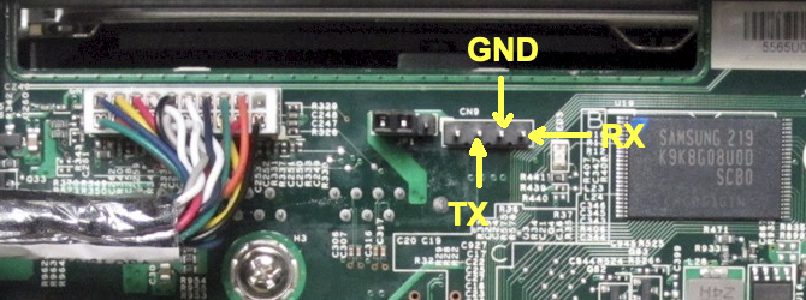

# Installing Debian 12 (bookworm) on Lenovo Iomega ix4-300d

Lenovo Iomega ix4-300s is a NAS released in late 2012 equipped with:
- Marvell Armada XP 1.3GHz Dual Core (MV78230 ARMv7 SoC)
- 512MB DDR3 Memory
- 4 x 3.5” SATA II (No Hot Swap)
- 2 x 1 GbE Ethernet ports
- 1 x USB 3.0 port
- 2 x USB 2.0 ports

The latest **firmware** update Version 4.1.414.34909 can be found here:

http://download.lenovo.com/nas/lifeline/h4c-4.1.414.34909.tgz

The latest **imager** with that version can be found here:

https://download.lenovo.com/nasupdate/asgimage/h4c-4.1.414.34909.zip

The original firmware is based on Debian 7 (wheezy) and it is stored into a flash memory. NAS can boot without any disk if the flash is ok. If the flash is corrupted the above imager must be used.

```
BootROM 1.15
Booting from NAND flash
DDR3 Training Sequence - Ver 2.3.4 
DDR3 Training Sequence - Ended Successfully 
BootROM: Image checksum verification PASSED

 __   __                      _ _
|  \/  | __ _ _ ____   _____| | |
| |\/| |/ _` | '__\ \ / / _ \ | |
| |  | | (_| | |   \ V /  __/ | |
|_|  |_|\__,_|_|    \_/ \___|_|_|
         _   _     ____              _
        | | | |   | __ )  ___   ___ | |_ 
        | | | |___|  _ \ / _ \ / _ \| __| 
        | |_| |___| |_) | (_) | (_) | |_ 
         \___/    |____/ \___/ \___/ \__| 
 ** LOADER 2.3.2.6  **


U-Boot 2009.08 (Mar 04 2013 - 11:13:04) Marvell version:  2.3.2 PQ
U-Boot Addressing:
       Code:            00600000:006BFFF0
       BSS:             00708EC0
       Stack:           0x5fff70
       PageTable:       0x8e0000
       Heap address:    0x900000:0xe00000
Board: DB-78230-BP rev 2.0 Wistron
SoC:   MV78230 A0
       running 2 CPUs
       Custom configuration
CPU:   Marvell PJ4B (584) v7 (Rev 2) LE
       CPU # 0
       CPU @ 1333Mhz, L2 @ 667Mhz
       DDR @ 667Mhz, TClock @ 250Mhz
       DDR 32Bit Width, FastPath Memory Access
       DDR ECC Disabled
PEX 0.0(0): Root Complex Interface, Detected Link X4, GEN 1.1
PEX 1.0(1): Root Complex Interface, Detected Link X1, GEN 2.0
DRAM:  512 MB
       CS 0: base 0x00000000 size 512 MB
       Addresses 14M - 0M are saved for the U-Boot usage.
NAND:  1024 MiB
Bad block table found at page 524224, version 0x01
Bad block table found at page 524160, version 0x01
nand_read_bbt: Bad block at 0x000003c60000
FPU initialized to Run Fast Mode.
USB 0: Host Mode
USB 1: Host Mode
USB 2: Device Mode
Modules Detected:
MMC:   MRVL_MMC: 0
Net:   egiga0 [PRIME], egiga1
Hit any key to stop autoboot:  0 

NAND read: device 0 offset 0x120000, size 0x400000
 4194304 bytes read: OK

NAND read: device 0 offset 0x520000, size 0x400000
 4194304 bytes read: OK
## Booting kernel from Legacy Image at 00040000 ...
   Image Name:   Linux-3.2.40
   Created:      2020-01-02  11:18:50 UTC
   Image Type:   ARM Linux Kernel Image (uncompressed)
   Data Size:    3656376 Bytes =  3.5 MB
   Load Address: 00008000
   Entry Point:  00008000
   Verifying Checksum ... OK
## Loading init Ramdisk from Legacy Image at 02000000 ...
   Image Name:   
   Created:      2020-01-14  10:40:35 UTC
   Image Type:   ARM Linux RAMDisk Image (bzip2 compressed)
   Data Size:    3012478 Bytes =  2.9 MB
   Load Address: 00000000
   Entry Point:  00000000
   Verifying Checksum ... OK
   Loading Kernel Image ... OK
OK

Starting kernel ...

Uncompressing Linux... done, booting the kernel.


Welcome to CenterPoint.
ix4-300d login:
```
```
root@ix4-300d:/# cat /etc/debian_version 
7.11
```
```
root@ix4-300d:/# cat /proc/version 
Linux version 3.2.40 (soho@bsoho083.iomegacorp.com) (gcc version 4.7.2 (crosstool-NG 1.20.0) ) #1 SMP Thu Jan 2 06:18:39 EST 2020 v2.1.1.1
```
```
root@ix4-300d:/# cat /proc/mtd        
dev:    size   erasesize  name
mtd0: 000e0000 00020000 "uboot"
mtd1: 00020000 00020000 "env"
mtd2: 00020000 00020000 "env2"
mtd3: 00400000 00020000 "zImage"
mtd4: 00400000 00020000 "initrd"
mtd5: 3f200000 00020000 "boot"
mtd6: 40000000 00020000 "flash"
```
```
root@ix4-300d:/# cat /proc/cpuinfo 
Processor       : Marvell PJ4Bv7 Processor rev 2 (v7l)
processor       : 0
BogoMIPS        : 1332.01

processor       : 1
BogoMIPS        : 1332.01

Features        : swp half thumb fastmult vfp edsp vfpv3 tls 
CPU implementer : 0x56
CPU architecture: 7
CPU variant     : 0x2
CPU part        : 0x584
CPU revision    : 2

Hardware        : Marvell Armada XP Development Board
Revision        : 0000
Serial          : 0000000000000000
```

The bootloader is Marvell U-Boot. My NAS has the following signature:

`U-Boot 2009.08 (Mar 04 2013 - 11:13:04) Marvell version:  2.3.2 PQ`.

The End Of Service Life (EOSL) was March 31, 2020.


## Prerequisites

- USB-to-TTL adapter (mandatory) to connect to the bootloader
- A TFTP server (faster) or and USB stick (slower) to download the Debian installer
- A PC with macOS or Windows. The following procedure is for macOS because we do not need any additional software to install for complete the task. The procedure for Windows is not documented here.
- A Linux box or a virtual machine with any Linux flavour (optional) to prepare the Debian installed image. I used an online Ubuntu VM on https://www.onworks.net.

## Preparing the file

On a Linux box:

1. Download `vmlinuz`, `initrd.gz` and `armada-xp-lenovo-ix4-300d.dtb` files from the Debian website: 

   https://deb.debian.org/debian/dists/bookworm/main/installer-armhf/current/images/netboot/vmlinuz
   https://deb.debian.org/debian/dists/bookworm/main/installer-armhf/current/images/netboot/initrd.gz
   https://deb.debian.org/debian/dists/bookworm/main/installer-armhf/current/images/device-tree/armada-xp-lenovo-ix4-300d.dtb

2. Append dtb file to the kernel: 
   ```
   cat vmlinuz armada-xp-lenovo-ix4-300d.dtb > vmlinuz_ix4_300d
   ```

3. Create an uImage with appended init ramdisk:
   ```
   mkimage -A arm -O linux -T multi -C none -a 0x04000000 -e 0x04000000  -n "Debian armhf installer" -d vmlinuz_ix4_300d:initrd.gz uImage_di_ix4_300d_bookworm
   mkimage -A arm -O linux -T kernel -C none -a 0x04000000 -e 0x04000000  -n "Debian armhf installer" -d vmlinuz_ix4_300d uImage_ix4_300d_bookworm
   mkimage -A arm -O linux -T ramdisk -C none -a 0x2000000 -e 0x2000000  -n "Debian armhf installer" -d initrd.gz uInitrd_ix4_300d_bookworm
   ```
   > [!NOTE]
   > The `mkimage` command is used to create images for use with the U-Boot boot loader. Thes images can contain the linux kernel, device tree blob, root file system image, firmware images etc., either separate or combined.
   > 
   > mkimage supports many image formats. Some of these formats may be used by embedded boot firmware to load U-Boot. Others may be used by U-Boot to load Linux (or some other kernel):
   >
   >The legacy image format concatenates the individual parts (for example, kernel image, device tree blob and ramdisk image) and adds a 64 byte header containing information about the target architecture, operating system, image type, compression method, entry points, time stamp, checksums, etc.

For lazy people the final file is also available [here](uImage_ix4_300d_bookworm) ready to download.

## Preparing the TFTP server

_Skip it if you want to proceed with an USB stick._

1. Copy the `uImage_ix4_300d_bookworm` file prepared above into `/private/tftpboot` folder of macOS.
   > [!NOTE]
   > By default the built in macOS TFTP server uses the folder `/private/tftpboot` which is hidden in Finder, but can be accessed by using “Go to Folder” or hitting Command+Shift+G and entering `/private/tftpboot`
3. Open a Terminal an execute the following command
   ```
   sudo launchctl load -F /System/Library/LaunchDaemons/tftp.plist
   ```
   ```
   sudo launchctl start com.apple.tftpd
   ```
   
## Preparing the USB stick

_Skip it if you prepared a TFTP server._

1. Create an ext2 partition
2. Copy 

## Connecting the USB-to-TTL adapter

UART is on connector CN9 (four pins). Connection parameters are 115200/8N1.



Pin|Function|Description
---|--------|-----------
1|VCC|VCC can be controlled by the adjacent JP1: bridging 1 and 2 provides 3V3, bridging 2 and 3 provides 5V - but beware that this does NOT change the TX/RX voltage which is 3V3 max. VCC is not connected to the USB-to-TTL adapter.
2|TX|Connect to the RX pin of your USB-to-TTL adapter
3|GND|Connect to GND of your USB-to-TTL adapter
4|RX|Connect to the TX pin of your USB-to-TTL adapter

1. Connect the USB-to-TTL adapter via USB to a PC. The following procedure is for macOS but once the necessary changes have been made can be completed with Windows too.
2. On macOS Open a Terminal and execute
   ```screen /dev/cu.SLAB_USBtoUART 115200```
3. Power on the Lenovo Iomega ix4-300d
4. Press any key to stop the booting process and receive the Marvell U-Boot prompt

```
BootROM 1.15
Booting from NAND flash
DDR3 Training Sequence - Ver 2.3.4 
DDR3 Training Sequence - Ended Successfully 
BootROM: Image checksum verification PASSED

 __   __                      _ _
|  \/  | __ _ _ ____   _____| | |
| |\/| |/ _` | '__\ \ / / _ \ | |
| |  | | (_| | |   \ V /  __/ | |
|_|  |_|\__,_|_|    \_/ \___|_|_|
         _   _     ____              _
        | | | |   | __ )  ___   ___ | |_ 
        | | | |___|  _ \ / _ \ / _ \| __| 
        | |_| |___| |_) | (_) | (_) | |_ 
         \___/    |____/ \___/ \___/ \__| 
 ** LOADER 2.3.2.6  **


U-Boot 2009.08 (Mar 04 2013 - 11:13:04) Marvell version:  2.3.2 PQ
U-Boot Addressing:
       Code:            00600000:006BFFF0
       BSS:             00708EC0
       Stack:           0x5fff70
       PageTable:       0x8e0000
       Heap address:    0x900000:0xe00000
Board: DB-78230-BP rev 2.0 Wistron
SoC:   MV78230 A0
       running 2 CPUs
       Custom configuration
CPU:   Marvell PJ4B (584) v7 (Rev 2) LE
       CPU # 0
       CPU @ 1333Mhz, L2 @ 667Mhz
       DDR @ 667Mhz, TClock @ 250Mhz
       DDR 32Bit Width, FastPath Memory Access
       DDR ECC Disabled
PEX 0.0(0): Root Complex Interface, Detected Link X4, GEN 1.1
PEX 1.0(1): Root Complex Interface, Detected Link X1, GEN 2.0
DRAM:  512 MB
       CS 0: base 0x00000000 size 512 MB
       Addresses 14M - 0M are saved for the U-Boot usage.
NAND:  1024 MiB
Bad block table found at page 524224, version 0x01
Bad block table found at page 524160, version 0x01
nand_read_bbt: Bad block at 0x000003c60000
FPU initialized to Run Fast Mode.
USB 0: Host Mode
USB 1: Host Mode
USB 2: Device Mode
Modules Detected:
MMC:   MRVL_MMC: 0
Net:   egiga0 [PRIME], egiga1
Hit any key to stop autoboot:  0 
Marvell>> 
```

## Boot the NAS from TFTP server

_Skip it if you prepared the USB stick._

Assuming `192.168.1.10` is the macOS IP address (TFTP server) and `192.168.1.111` ia an available IP address in your network, from `Marvell>>` prompt enter the following commands.

1. Set the IP address of the NAS: 
   ```
   setenv ipaddress 192.168.1.111
   ```

2. Set the IP address of the macOS TFTP server: 
   ```
   setenv serverip 192.168.1.10
   ```

3. Check if network connection works:
   ```
   ping 192.168.1.10
   ```

4. Transfer the Debian installer via TFTP into the NAS RAM:
   ```
   tftpboot uImage_ix4_300d_bookworm
   ```

5. Boot the Debian installer in RAM:
   ```
   bootm 0x2000000
   ```

## Boot th NAS from USB stick

_Skip it if you prepared the TFTP server._

1. Insert the USB stick into the **rear top** USB port (mandatory).

2. From `Marvell>>` prompt enter the following commands:
   ```
   usb start
   usb tree
   usb info
   usb part
   usb stop
   ext2load usb 0:1 0x0040000 uImage
   ext2load usb 0:1 0x2000000 uInitrd
   setenv bootargs $console $mtdparts root=/dev/sda2 rw rootdelay=10
   bootm 0x40000 0x2000000
   ```

The log of previous commands is available in the following:
```
Marvell>> usb reset
(Re)start USB...
USB:   Active port:     0
Register 10011 NbrPorts 1
USB EHCI 1.00
scanning bus for devices... 2 USB Device(s) found
Waiting for storage device(s) to settle before scanning...
       scanning bus for storage devices... 1 Storage Device(s) found
Marvell>> usb part

Partition Map for USB device 0  --   Partition Type: DOS

Partition     Start Sector     Num Sectors     Type
    1                 2048         2097152      83
Marvell>> usb stop
stopping USB..
Marvell>> ext2load usb 0 0x0040000 uImage
Loading file "uImage" from usb device 0:1 (usbda1)
5351843 bytes read
Marvell>> ext2load usb 0:1 0x2000000 uInitrd
Loading file "uInitrd" from usb device 0:1 (usbda1)
26337316 bytes read
.....

Debian GNU/Linux 12 lenovo ttyS0
lenovo login: root
Password: 
Linux lenovo 6.1.0-11-armmp-lpae #1 SMP Debian 6.1.38-4 (2023-08-08) armv7l
The programs included with the Debian GNU/Linux system are free software;
the exact distribution terms for each program are described in the
individual files in /usr/share/doc/*/copyright.
Debian GNU/Linux comes with ABSOLUTELY NO WARRANTY, to the extent
permitted by applicable law.
root@lenovo:~# 
```

## Debian installation

The Debian installer should start in the serial console window. Go through the process as shown on screen. 
Skipping grub and bootloader results in the following warning: 

You will need to boot manually with the /vmlinuz kernel on partition /dev/sda1 and root=/dev/sda2 passed as a kernel argument. 

Do not complete the final 'cleanup and reboot' stage of the install but choose to execute a shell instead. 

```
mount --bind /dev /target/dev
mount -t proc none /target/proc
mount -t sysfs none /target/sys
chroot /target /bin/sh
apt-get update
apt-get install flash-kernel
```

Replace the content of the flash-kernel database file `/etc/flash-kernel/db` using `nano`: 
```
nano /etc/flash-kernel/db
```

with the following content
```
Machine: Lenovo Iomega ix4-300d
Kernel-Flavors: armmp armmp-lpae
DTB-Id: armada-xp-lenovo-ix4-300d.dtb
DTB-Append: yes
U-Boot-Kernel-Address: 0x00008000
U-Boot-Initrd-Address: 0x0
Boot-Kernel-Path: /boot/uImage
Boot-Initrd-Path: /boot/uInitrd
Boot-DTB-Path: /boot/dtb
Required-Packages: u-boot-tools
Bootloader-Sets-Incorrect-Root: no
```

Update initramfs and kernel: 
```
update-initramfs -u
```

Set label on the rootfs partition: 
```
e2label /dev/sda2 rootfs
```

Exit chroot and reboot: 
```
exit
reboot
```

Press any key to stop the booting process again.


## Links

https://forum.doozan.com/read.php?2,131833

https://github.com/benoitm974/ix4-300d/wiki

https://github.com/5p0ng3b0b/ix4-300d
